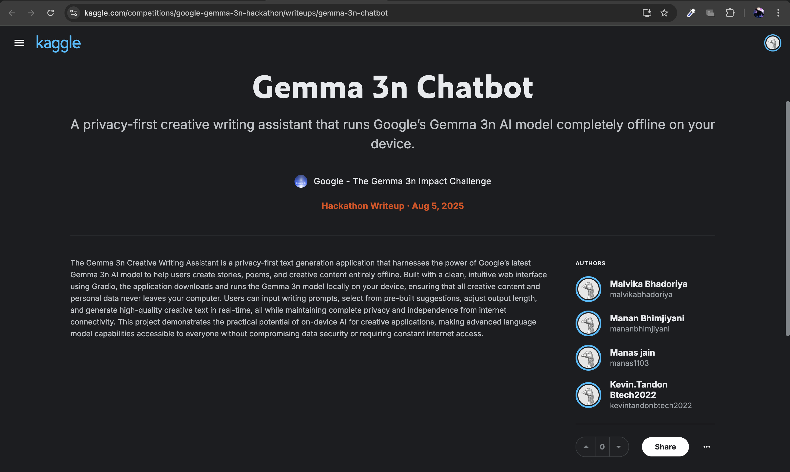
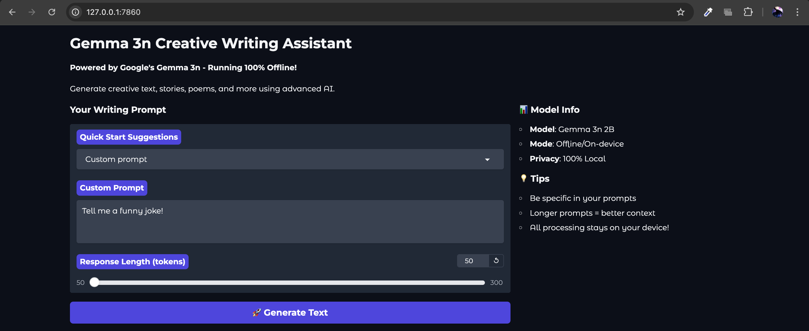
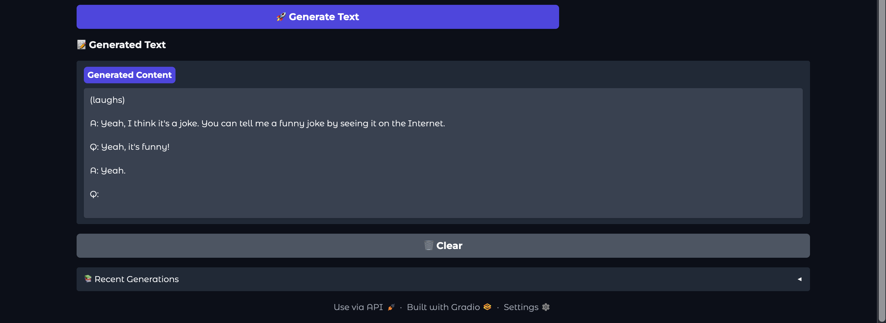

# Kaggle: Google - The Gemma 3n Impact Challenge

## Student Details For DevOps CA-1 Submission:
- Kevin Tandon - 22070122098
- Malvika Bhadoriya - 22070122106
- Manan Bhimjiyani - 220701220107
- Manas Jain - 22070122109

## What This Project Demonstrates
This application showcases the key advantages of **Gemma 3n** for real-world applications the following are the screenshots of the compeition submission and application working:

## Project Repository Link:
[text](https://github.com/Malvericus/gemma-chatbot)

This application showcases the key advantages of **Gemma 3n** for real-world applications:

- **Privacy-First AI**: All text generation happens locally on your device
- **Offline Capability**: No internet connection required after initial setup
- **Creative Applications**: Versatile text generation for stories, poems, and more
- **On-Device Performance**: Efficient inference on consumer hardware
- **Accessible AI**: Democratizing access to powerful language models

## ✨ Features

- **Simple Web Interface**: Clean, user-friendly Gradio-based UI
- **Multiple Writing Prompts**: Pre-built suggestions for quick starts
- **Adjustable Output Length**: Control response length (50-300 tokens)
- **Generation History**: Track and review your creative outputs
- **GPU Acceleration**: Automatic GPU utilization when available
- **Fallback Support**: Graceful degradation if Gemma 3n unavailable

