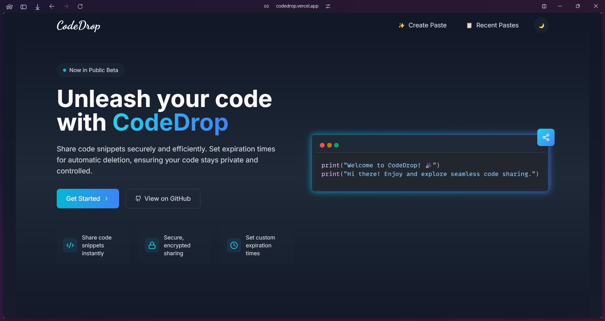

# 🖥️ CodeDrop

**CodeDrop** allows you to easily paste and share code snippets with others. Set expiration times for automatic deletion and ensure secure, temporary sharing. Perfect for quick collaborations and ephemeral exchanges.



## 🌐 Live Demo

Visit the live demo of CodeDrop hosted on Vercel: https://codedrop.vercel.app

## ✨ Features

- **Paste and Share:** Quickly paste and share code snippets with a simple interface.
- **Expiration Times:** Set custom expiration times for snippets, ensuring temporary sharing.
- **Syntax Highlighting:** Automatic syntax highlighting for improved readability.
- **Responsive Design:** A modern, user-friendly interface adaptable to any device.
- **Share Options:** Easily share snippets with others through a generated link.
- **Download Snippets:** Option to download snippets as a PDF for offline access.
- **Clipboard Copy:** Copy code snippets directly to your clipboard for quick use.

## 🛠️ Tech Stack

- **Frontend:** SvelteKit
- **Backend:** Node.js, Express
- **Database:** MongoDB (using MongoDB+srv for scalability)
- **ORM:** Prisma
- **Deployment:** Vercel
- **Syntax Highlighting:** svelte-highlight
- **PDF Generation:** jsPDF library
- **Clipboard Copy:** clipboard.js
- **Styling:** Tailwind CSS for responsive design

## 🚀 Getting Started

Follow these instructions to set up CodeDrop on your local machine.

### 📋 Prerequisites

Ensure you have the following installed:

- **Node.js** (version 16.x or higher)
- **npm** (Node Package Manager)

### 🛠️ Installation

1. **Fork and Clone the Repository:**

   ```bash
   git clone https://github.com/your-username/codedrop.git
   cd codedrop
   ```

2. **Create a MongoDB Atlas Cluster:**

   Instead of a local MongoDB setup, we’ll use a MongoDB Atlas cluster for scalability and ease of use.

   - **Create a MongoDB Atlas Account:** If you don't have an account, sign up at [MongoDB Atlas](https://www.mongodb.com/cloud/atlas).
   - **Set Up a New Cluster:** Follow the steps in the [MongoDB Atlas documentation](https://www.mongodb.com/docs/atlas/getting-started/) to create your new cluster.
   - **Get Your Connection URL:** Once the cluster is ready, go to the "Database" section in Atlas, click "Connect," and select "Connect your application." Copy the connection string.

   Update your `.env` file with the following, replacing `<username>`, `<password>`, and `<cluster-url>` with your details:

   ```env
   DATABASE_URL="mongodb+srv://<username>:<password>@<cluster-url>/your-database-name?retryWrites=true&w=majority"
   ```

   This will connect your app to the MongoDB Atlas cluster.

3. **Install Dependencies:**

   ```bash
   npm install
   ```

4. **Run the Development Server:**

   ```bash
   npm run dev
   ```

   This will start the SvelteKit development server. Open your browser and visit `http://localhost:5173` to view the application.

### 🏗️ Building the Project

To create an optimized production build:

```bash
npm run build
```

This will generate a production-ready version of your project in the `build` directory.

### 🔍 Previewing the Production Build

To preview the production build locally:

```bash
npm run preview
```

## 🤝 Contributing

We welcome contributions from the community! Here's how you can get involved:

1. **Fork the Repository:**

   Click the "Fork" button at the top right of this page to create your own copy of the repository.

2. **Clone Your Fork:**

   ```bash
   git clone https://github.com/your-username/codedrop.git
   cd codedrop
   ```

3. **Create a Branch for Your Feature:**

   ```bash
   git checkout -b feature/your-feature-name
   ```

4. **Make Your Changes:**

   Implement your changes or new features.

5. **Commit Your Changes:**

   ```bash
   git commit -m "Add your descriptive commit message here"
   ```

6. **Push to Your Fork:**

   ```bash
   git push origin feature/your-feature-name
   ```

7. **Create a Pull Request:**

   Go to the original repository and open a pull request, providing a clear description of your changes.

### 📝 Contribution Guidelines

- Follow the existing code style and structure.
- Write clear and concise commit messages.
- Ensure your code works by testing locally before submitting a pull request.

Thank you for contributing to **CodeDrop**! 🎉