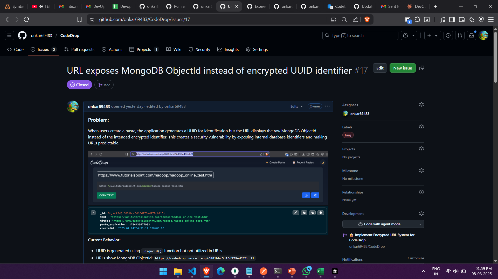
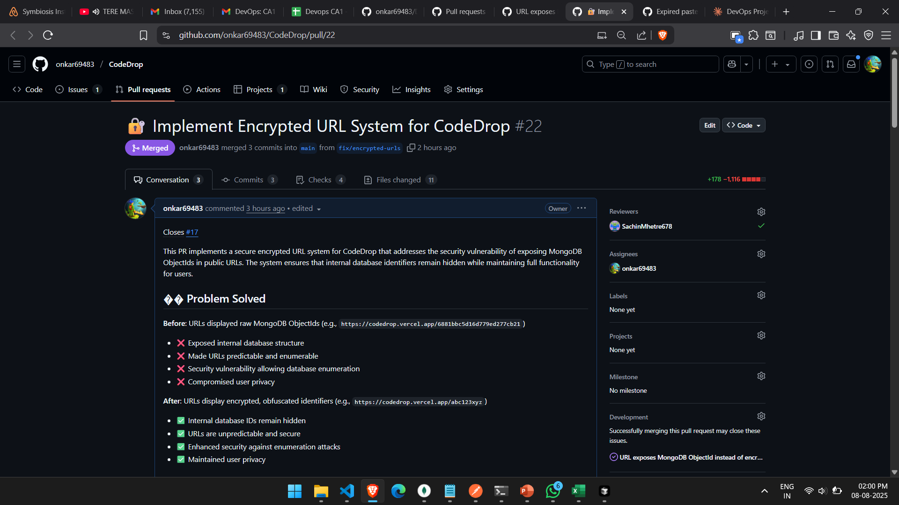
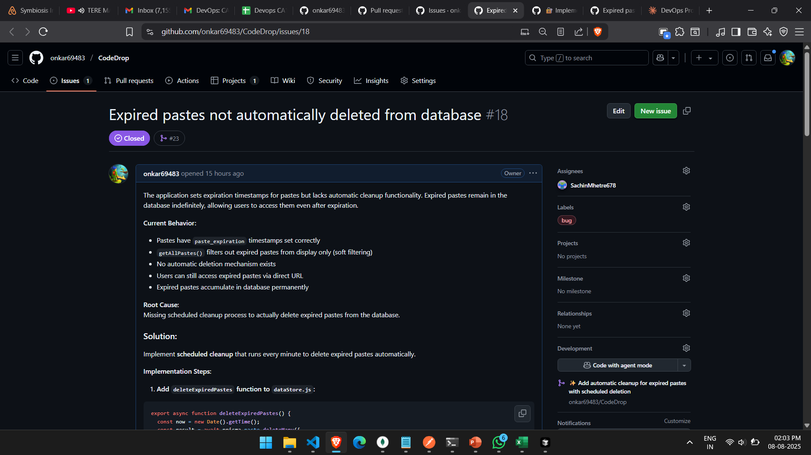
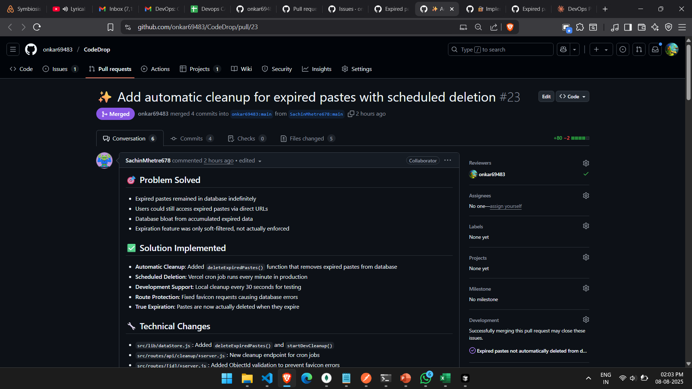
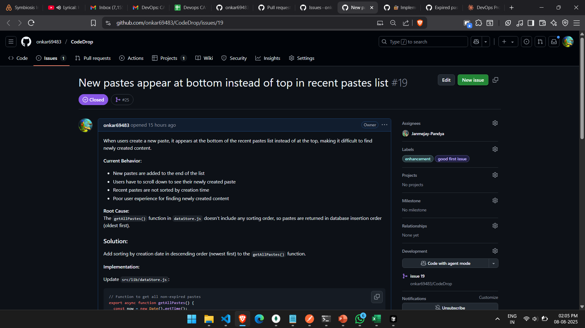
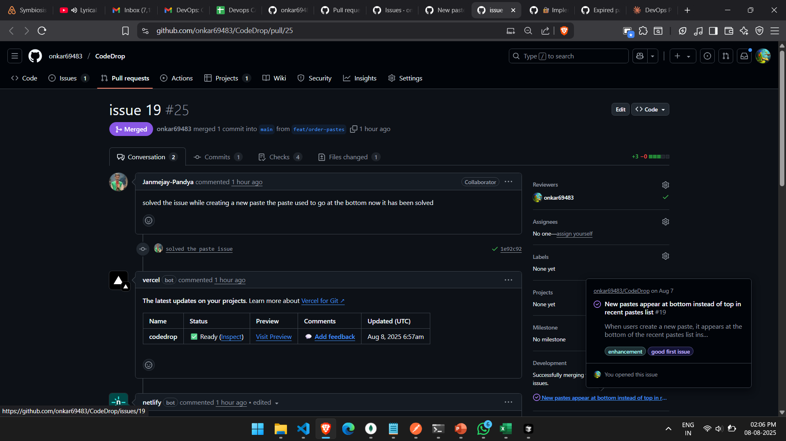
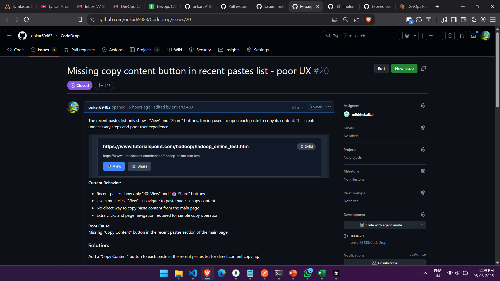
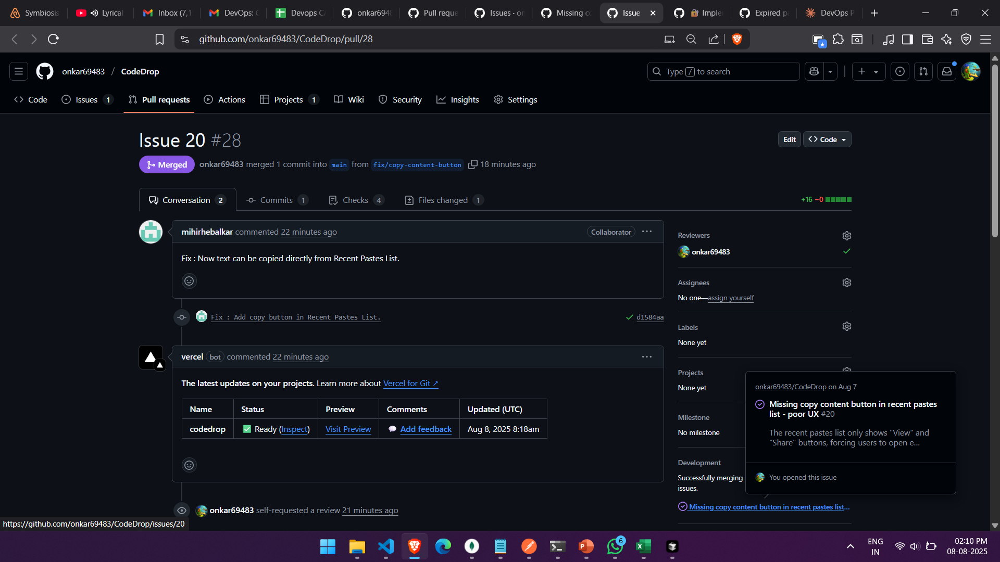

# CodeDrop Enhancements - GitHub Documentation

## Team Members - CSE B
- **Janmejay Pandya - 22070122086** (TH1)
- **Sachin Mhetre - 22070122119** (TH1)
- **Mihir Hebalkar - 22070122120** (TH1)
- **Onkar Mendhapurkar - 22070122135** (TH2)

---

## 🔐 Issue #17: Security Vulnerability - Exposed MongoDB ObjectIds

### GitHub Issue Page

*GitHub issue page documenting the security vulnerability*

### Pull Request #22: Secure Encrypted URL System

*GitHub pull request page showing the security fix implementation*

**🔗 Links:**
- [Issue #17](https://github.com/onkar69483/CodeDrop/issues/17)
- [Pull Request #22](https://github.com/onkar69483/CodeDrop/pull/22)

---

## 🗑️ Issue #18: Missing Automatic Cleanup for Expired Pastes

### GitHub Issue Page

*GitHub issue page documenting the expired paste cleanup problem*

### Pull Request #23: Automated Cleanup System

*GitHub pull request page showing the automated cleanup implementation*

**🔗 Links:**
- [Issue #18](https://github.com/onkar69483/CodeDrop/issues/18)
- [Pull Request #23](https://github.com/onkar69483/CodeDrop/pull/23)

---

## 📊 Issue #19: Incorrect Paste Ordering in Recent List

### GitHub Issue Page

*GitHub issue page documenting the paste ordering problem*

### Pull Request #25: Fixed Chronological Sorting

*GitHub pull request page showing the ordering fix implementation*

**🔗 Links:**
- [Issue #19](https://github.com/onkar69483/CodeDrop/issues/19)
- [Pull Request #25](https://github.com/onkar69483/CodeDrop/pull/25)

---

## 🔄 Issue #20: Missing Copy Content Button

### GitHub Issue Page

*GitHub issue page documenting the missing copy functionality*

### Pull Request #28: Add Copy Content Button

*GitHub pull request page showing the copy button implementation*

**🔗 Links:**
- [Issue #20](https://github.com/onkar69483/CodeDrop/issues/20)
- [Pull Request #28](https://github.com/onkar69483/CodeDrop/pull/28)

---

## 📁 Screenshot Files

```
screenshots/
├── issue17.png    # Screenshot of GitHub Issue #17 page
├── pr22.png       # Screenshot of GitHub Pull Request #22 page
├── issue18.png    # Screenshot of GitHub Issue #18 page  
├── pr23.png       # Screenshot of GitHub Pull Request #23 page
├── issue19.png    # Screenshot of GitHub Issue #19 page
├── pr25.png       # Screenshot of GitHub Pull Request #25 page
├── issue20.png    # Screenshot of GitHub Issue #20 page
└── pr28.png       # Screenshot of GitHub Pull Request #28 page
```