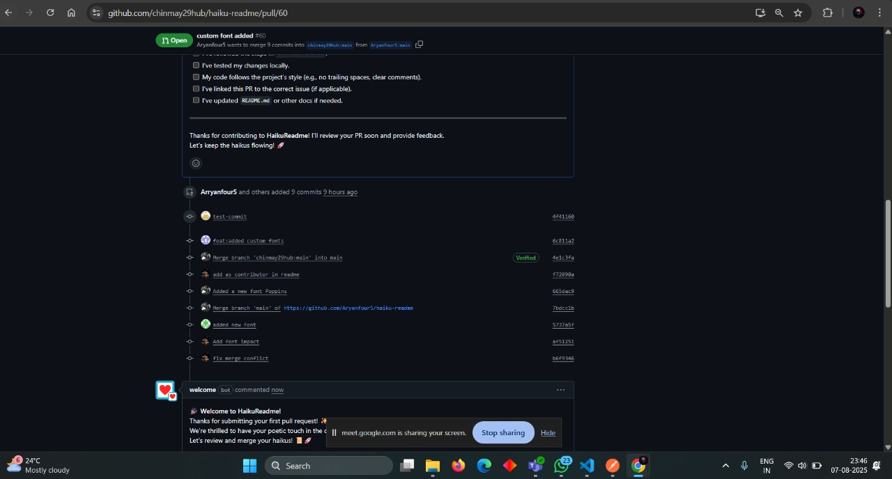

# Devops-CA1
## Additional Custom Fonts

We have expanded the backend by adding more custom fonts to the existing font management feature. This enhancement provides users with a wider variety of font options for rendering text-based content. The backend continues to support uploading, listing, and applying custom fonts, now with an extended font library for greater personalization.

### Features

- Expanded selection of custom fonts available in the backend.
- Continued support for uploading and managing fonts via backend endpoints.
- Easy application of new fonts to generated content.

## Contributors

- Aryan Bachute
- Atharva Sawant
- Shreyash Govidwar
- Miran Firdausi

## Screenshots

### Commits

